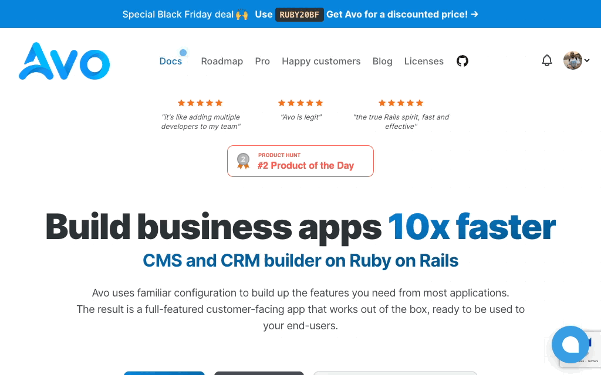

# Stimulus confetti

Are you in the mood to add confetti to your stimulus application? You're in luck! This package helps you do that in no-time.


## Install

Add the package to your project.

```bash
yarn add stimulus-confetti
# or
npm install stimulus-confetti
```

## Register the stimulus controller

Register the controller in your Stimulus app.

```javascript
import { Confetti } from "stimulus-confetti"

application.register('confetti', Confetti)
```

## Use the DOM

```html
<a
  href="https://github.com/avo-hq/avo"
  target="_blank"
  data-controller="confetti"
  data-action="click->confetti#spray"
>Star Avo</a>
```

When you click that link, the confetti will spray and after the animation finishes, the browser will navigate to that location.

## Animation types

There are three types of animation.

1. **Basic** which shoots of confetti under your mouse

```html
<a
  href="https://github.com/avo-hq/avo"
  target="_blank"
  data-controller="confetti"
  data-action="click->confetti#spray"
  data-animation-value="basic"
>Star Avo</a>
```


2. **School pride** which adds two cannons on each side of the screen

```html
<a
  href="https://github.com/avo-hq/avo"
  target="_blank"
  data-controller="confetti"
  data-action="click->confetti#spray"
  data-animation-value="school-pride"
  data-duration-value="10"
>Star Avo</a>
```


3. **Stars** which will spray stars from under your cursor

```html
<a
  href="https://github.com/avo-hq/avo"
  target="_blank"
  data-controller="confetti"
  data-action="click->confetti#spray"
  data-animation-value="stars"
>Star Avo</a>
```



## Configuration

### `data-animation-value`

Values can be `basic`, `school-pride`, or `stars` and will change the type of animation.

Defaults to `basic`.

### `follow`

Controls whether at the end of the animation, the browser should follow the link. You can set it to `false` when you want to test the animation.

Defaults to `true`.

### `duration`

The duration, in seconds, for the **School pride** animation.

Defaults to `5`.

### `first-color`

The first color for the **School pride** animation.
Defaults to `#0886DE`

### `second-color`

The second color for the **School pride** animation.
Defaults to `#FF6154`

### `debug`

Controls wether log messages are being displayed in the console.

Defaults to `false`.

### `particleCount`, `startVelocity`, `spread`, and `ticks`

Controls various setting for the [`canvas-confetti`](https://github.com/catdad/canvas-confetti) package.

## Thanks

This package is based on the [`canvas-confetti`](https://github.com/catdad/canvas-confetti) package, so please [donate](https://github.com/sponsors/catdad) to help them and support their work.

## Try Avo ⭐️

If you enjoy this package try out Avo. It helps developers build internal tools, admins, CMSes, CRMs, and any other type of business apps 10x faster on top of Ruby on Rails.

[](https://github.com/avo-hq/avo)